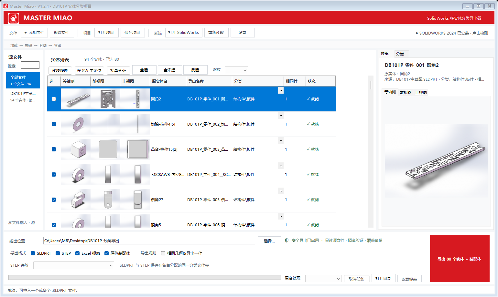

# Master Miao V1.2.4

[中文](README.md) | [English](README.en.md) | [开发历程 / Development history](DEVELOPMENT_HISTORY.md) | [架构说明 / Architecture](ARCHITECTURE.md)

**Master Miao** 是一个免安装、离线运行的 SolidWorks 多实体零件分类导出器，用来读取一个或多个多实体零件，查看实体三视图，重命名和分类，并安全导出独立零件、可选 STEP、原位装配体及带三张缩略图的 Excel 清单。



本仓库保存可复现构建的源代码与验证文档，不包含用户项目、运行时 `Data`、SolidWorks 测试零件或本机缓存。可直接运行的 V1.2.4 压缩包发布在仓库的 Releases 页面。

项目为何产生、各阶段如何演进以及 STEP 导出方案的决策过程，详见 [开发历程](DEVELOPMENT_HISTORY.md)。源文件职责、进程边界、数据流和安全约束详见 [架构说明](ARCHITECTURE.md)。

## 使用条件

- Windows 10/11，.NET Framework 4.x。
- 本机安装并能正常启动 SolidWorks；当前构建面向 SolidWorks 2024（Revision 32.0.1）验证。
- 开始读取或导出前保存正在编辑的 SolidWorks 文档；任务期间不要操作、切换或关闭 SolidWorks。
- 程序可复用一个已打开的 SolidWorks。检测到多个 SolidWorks 进程时会停止任务，避免连接到错误窗口。

## 快速使用

1. 双击 `MasterMiao.exe`，首次运行选择中文或 English；可勾选下次不再询问，之后在“设置”中随时更改。
2. 拖入或选择一个或多个 `.SLDPRT` 文件。确认 SolidWorks 使用提示后，程序读取实体并生成等轴测、前视和上视三张视图。
3. 使用列表模式批量浏览、Ctrl/Shift 多选和批量分类；也可打开“逐项整理”，一次专注一个零件并查看三张大图、重命名、分类或跳过。
4. 标签就是目标文件夹。在“分类”页可新建、重命名和删除文件夹，或在电池式关系图中拖动目录块修改父子关系。
5. 勾选“相同几何仅导出一件”后，列表把重复实体折叠为一个代表项，显示数量和来源；名称、标签及导出选择会应用到整组。
6. 选择最终输出目录和 SLDPRT、STEP、Excel、原位装配体等选项，然后导出。
7. 未完成工作可保存为一个工作项目文件夹。该目录包含 `project.swbody.json` 和 `Previews`，下次打开即可继续，不会复制原始 SLDPRT。

## V1.2.4 功能

- 修复列表“导出名称”每输入一个字符就退出编辑的问题。文本名称仅在结束编辑时写回项目，并新增中英文“完成改名 / Finish rename”按钮；连续多字符输入已纳入逻辑自检。
- STEP 增加两种存放模式：“与 SLDPRT 同目录”保持原有行为；“独立双目录（镜像分类树）”在主输出目录下生成 `零件源文件` 与 `STEP生产文件` 两套根目录，并在两边复用完全相同的分类父子结构。
- 独立双目录模式下，零件 SLDPRT 与原位装配体 SLDASM 进入 `零件源文件`；零件 STEP 与装配体 STEP 进入 `STEP生产文件`；Excel 清单仍位于主输出目录并记录每个文件的实际路径。
- STEP 仍先在隔离暂存区生成并校验，只有通过 `ISO-10303-21;` 文件头检查后才归位。新的目录选择只影响验证后的正式归类，不改变 SolidWorks 宏和装配体批量导出顺序。

## V1.2.3 品牌与基础功能

- 软件正式名称统一为 **Master Miao**；窗口标题、主界面、EXE 文件信息和 Excel 报表创建者均使用该名称。
- 使用用户提供的猫咪扳手图作为品牌源图，构建时生成包含 16、20、24、32、40、48、64、128、256 像素的 Windows 图标，并嵌入 EXE；主标题栏与红色页眉同步显示品牌图标。
- 读取成功后不再关闭多实体源零件；程序自动启动的 SolidWorks 也会保留并转交给用户，方便直接使用“在 SW 中定位”。多文件读取时保留所有成功读取的源零件。
- 没有运行中的 SolidWorks 时，可选择“由程序自动打开”“我已手动打开”或“取消”；主页面工具栏新增“打开 SolidWorks”按钮。
- 自动启动或自动化连接失败时显示原因并切换到手动模式。用户手动打开后点击“重试”，程序继续原读取任务，不需要重新导入文件。
- 修复 V1.2.0 在真实双击启动时，窗口句柄创建前调用 `BeginInvoke` 导致的启动崩溃；恢复检查现改为窗口显示后安全执行，并增加未抑制启动分支的自动回归测试。
- 列表中每个实体同时显示等轴测、前视和上视三张缩略图。
- 新增列表模式与逐项整理模式。逐项模式显示当前序号、已分类/未分类数量、三张大图、名称、标签、导出选择和输出路径。
- 列表支持 80%–200% 缩放及 `Ctrl + 鼠标滚轮`，缩放值会保存。
- 列表支持多选和批量分类，多源文件可以在同一项目中统一整理。
- 几何去重改为可视化折叠，只保留代表项；代表项编辑自动同步到整组。
- 新增“在 SW 中定位”。当源多实体零件已经在当前 SolidWorks 中打开时，可将同一源文件的一个或多个实体高亮显示；定位过程不保存文档，读取和导出期间禁用。
- 新增中文 / English 界面、首次语言提示、记住选择和设置切换；设置只保存在本地 JSON，不写注册表。
- 新增工作项目文件夹、自动保存、最近项目记录、异常恢复、源文件重新绑定和变化提示。
- 关闭程序时始终确认；任务进行中只允许安全取消。未完成工作可选择保存后关闭、不保存关闭或返回程序。
- Excel 清单升级为 15 列，每个零件嵌入等轴测、前视和上视三张图片，并随界面语言输出中文或英文表头。

## 原有自动化能力

- 检测 SolidWorks 安装版本、API、零件模板、装配体模板和 STEP 导出入口。
- 没有现有 SolidWorks 时，只有用户明确选择自动启动后才打开可见窗口。读取成功后保留该窗口和源零件；检测、失败或取消仍只回收 PID/启动时间均匹配的程序自有进程。
- 有一个用户会话时复用它，任务后恢复原活动文档、可见性、用户控制和命令状态，不退出用户的 SolidWorks。
- 活动文档、会话或关键保存过程受到干扰时停止输出并弹窗提醒。
- 独立导出 SLDPRT；可选 STEP；可按源零件生成原位装配体。
- STEP 使用随包提供的编译型 `MasterMiao.StepMacro.dll` 全自动执行，不要求用户手动运行宏。
- 重名策略：跳过、自动编号、覆盖前备份。
- 完成弹窗显示耗时、实际成功文件数和“辛苦了，愿灵感的火花永不熄灭”；失败时显示具体原因。

## STEP 导出方式

STEP 模式会同时导出 SLDPRT。程序先拆分并验证单实体零件，再生成临时或正式原位装配体；编译型宏临时启用 SolidWorks 的“将装配体零部件导出为单独 STEP 文件”选项，把装配体一次另存为 STEP，之后校验并归类。普通模式将 STEP 放在对应 SLDPRT 的分类目录；独立双目录模式则在 `零件源文件` 与 `STEP生产文件` 下镜像分类树，装配体 SLDASM 与装配体 STEP 也分别放在两套根目录。

宏在成功、失败和异常分支都会恢复原 STEP 选项。只有日志确认 `RESTORED|True`、批次返回成功且 STEP 文件通过 `ISO-10303-21;` 文件头检查后，文件才进入正式目录。

V1.1.2 的同一导出内核已在真实用户桌面完成三实体全自动验收：3 个 SLDPRT、3 个零件 STEP、1 个原位装配体、1 个装配体 STEP 和 1 份 Excel 报表全部成功。V1.2.4 没有修改 SolidWorks 宏或装配体批量导出调用顺序，只增加验证后正式文件的双目录路由；回归结果和桌面权限限制详见 `VALIDATION.md`。

## 项目保存与恢复

- 首次保存时选择一个位置和项目名称，程序创建 `<项目名>_SWBO项目`。
- `project.swbody.json` 保存源文件引用、名称、标签、目录树、导出设置、输出路径、列表缩放、逐项进度及上次导出状态。
- `Previews` 保存每个实体的三张预览图；不会复制原始 `.SLDPRT`。
- 已保存项目在编辑后自动保存；尚未指定项目位置时写入程序 `Data\Recovery`，下次启动可恢复。
- 源文件丢失时可重新指定位置；大小或修改时间变化时，程序提示重新读取后再导出。

## 安全边界

- 不安装服务、不联网、不写注册表；语言、最近路径和恢复信息均写入程序本地 `Data`。
- 原始 SLDPRT 以 `Silent + ReadOnly` 打开；程序没有保存源文件的代码路径。
- 导出前检查源文件大小与修改时间，并验证输出目录可写及剩余空间。
- 临时结果先写入任务暂存区；SLDPRT 重新打开并确认只有一个实体后才复制到输出目录。
- 装配体重新打开并验证组件数量、引用路径和固定状态后才提交。
- STEP 文件必须存在、非空并通过标准文件头检查；STEP 失败不会回滚已验证的 SLDPRT。
- 分类路径中的非法字符和路径穿越片段会被净化，正式输出限制在用户选择的主目录内。
- “覆盖”会先把旧文件移入 `Data\Backups`，不会直接永久删除。

## 重要限制

- “原位装配体”和“相同几何仅导出一件”不能同时启用。代表件无法保留重复实体各自不同的全局位置，程序会在导出前阻止该组合。
- STEP 和装配体模式要求本批次最终文件名全局唯一。
- 实体定位要求源零件已经在当前唯一的 SolidWorks 会话中打开；跨源多选定位会被阻止。
- 当前版本读取源文件保存时的活动配置，尚未提供配置选择器。
- 几何去重用体积、面积、面类型/面积、边面数量等指纹识别候选相同件，默认关闭。
- 程序能检测活动文档、进程和关键保存阶段的变化，但不能保证识别 SolidWorks 内部的每一种人工操作，因此任务提示期间仍应避免触碰 SolidWorks。

## Excel 报表

报表包含 15 列：等轴测、前视图、上视图、导出名称、源文件、原实体名称、分类文件夹、数量、SLDPRT 路径、STEP 路径、装配体路径、装配体 STEP 路径、装配体状态、验证状态和备注。表头冻结，支持筛选；数量为数值类型。

## 发行包目录

```text
MasterMiao.exe
MasterMiao.StepMacro.dll
MasterMiao.exe.config
MasterMiao.ico
MasterMiao-logo.png
SolidWorks.Interop.sldworks.dll
SolidWorks.Interop.swconst.dll
README.md
VALIDATION.md
TEST_RESULT.txt
THIRD_PARTY_NOTICE.md
UI_PREVIEW.png
UI_GUIDED.png
UI_RELATION.png
Source/
```

程序首次运行后会创建 `Data\Templates`、`Data\Cache`、`Data\Jobs`、`Data\Backups` 和 `Data\Recovery`。关闭程序后可清理 Cache 和已完成 Jobs；确认旧版本不再需要前请保留 Backups 和工作项目文件夹。

## 源码构建

源码为 9 个主程序 C# 文件、1 个编译型 STEP 宏文件及可复现的多尺寸图标构建脚本，不使用 NuGet、数据库、Office 自动化或安装器。运行 `build.ps1` 会先由原始品牌 PNG 生成 ICO，再调用系统 .NET Framework C# 编译器并引用本机 SolidWorks API 互操作程序集；产物只写入源码目录的 `build` 子目录。
